# <font face="楷体"  color='blue'> Python基础语法</font>

<p><font face="楷体" color='blue'>作者：Barranzi_</font></p>
<p><font face="楷体" color='blue'>个人github主页：[github](https://github.com/La0bALanG)</font></p>
<p><font face="楷体" color='blue'>个人邮箱：awc19930818@outlook.com</font></p>
<p><font face="楷体" color='blue'>新时代的铁饭碗：一辈子不管走到哪里都有饭吃(还能吃上热乎的)。——佚名</font></p>
<p><font face="楷体" color='red'> 免责声明：</font></p>
<p><font face='楷体' color='red'>		本系列笔记撰写初衷就是为了分享个人知识以及个人学习历程中的感悟及思考，所涉及到的内容`仅供学习与交流`，请勿用作`非法或商业用途`！由此引发的任何法律纠纷`后果自负`，与作者本人无关！</font></p>
<p><font face="楷体"  color='red'>版权声明：</font></p>
<p><font face='楷体' color='red'>		未经作者本人授权，禁止转载！请尊重原创！</font></p><p><font face='楷体' color='red'>既然学的是Python，不知道祖师爷是谁可还好？无图言x，上祖师爷！</font></p>


<p><font face="楷体" color='blue'>注：本文所有代码、案例测试环境：1.Linux -- 系统版本：Ubuntu20.04 LTS   2.windows -- 系统版本：WIN10 64位家庭版</font></p>
------

# Anaconda3简介

## Anaconda3介绍

​	Anaconda指的是一个开源的Python发行版本，其包含了conda、Python等180多个科学包及其依赖项。因为包含了大量的科学包，Anaconda 的下载文件比较大（约 531 MB），如果只需要某些包，或者需要节省带宽或存储空间，也可以使用Miniconda这个较小的发行版（仅包含conda和 Python）。
​	Anaconda3可以理解为一个集成工具。在实际的Python开发中，我们需要最基本的Python环境。环境的搭建需要安装Python解释器，以及可能用到的种种第三方开源函数库。我们确实大可以单独安装这些工具，但毕竟相对来说还是比较麻烦，比如大量的第三方库，第三方依赖都需要pip包管理工具进行安装，而这个pip也需要先安装好才能使用，且在Windows环境或Ubuntu环境下安装及配置相对也需要一些步骤。所以，与其这样需要用什么我再安装什么，倒不如有一个集成工具，它能一次性把我需要的所有工具一次性安装及自动配置好，那么我再去使用，就相对方便的多。Anaconda的作用就是类似这样的。

## Anaconda3下载

> 官网地址：https://www.anaconda.com/

​	官网会自动识别当前操作系统以向用户推送对应操作系统的安装文件的下载地址。

​	注意：官网下载极其龟速，主要原因是主机问题所致，与本地网络环境因素无关。

​	推荐在清华大学开源软件镜像站下载，版本与官网保持一致，且为国内的镜像源，下载速度很快。

> 清华大学开源软件镜像站Anaconda3下载地址：https://mirrors.tuna.tsinghua.edu.cn/anaconda/archive/

# Linux(Ubuntu)下Python环境搭建

## 手动配置Python环境（不使用Anaconda3）

​	目前商用版本Ubuntu20.04 LTS 桌面版操作系统自带Python3，所以无需配置直接使用即可。

## 使用Anaconda3配置Python环境

​	在清华大学开源软件镜像站下载Anaconda3安装包：https://mirrors.tuna.tsinghua.edu.cn/anaconda/archive/

​	下载方式：点击上述链接，进入页面，拉到最下面（这里列出了Anaconda3所有的历史版本，其按照更新的版本号进行排序展示，所以最新版本的在最下面），找到Anaconda3-5.3.1-Linux-x86_64.sh，直接点击即开始下载。

​	安装：打开终端，输入以下命令：

```python
bash Anaconda3-5.3.1-Linux-x86_64.sh,
```

​	回车，按照安装提示一路继续回车或输入“yes”,即自动执行安装程序。

​	配置Anaconda3环境变量。Anaconda3安装后需要替代Ubuntu自带的Python解释器，方法非常简单,打开终端，输入以下命令：

```python
sudo gedit ~/.bashrc
```

​	会打开一个文件，在文件最后一行后输入：

```python
export PATH=’/home/用户名/anaconda3/bin:$PATH’
```

​	用户名输入自己Ubuntu系统的用户名即可。输入完毕后保存，关闭，即配置完成。

​	注意：某些情况下提示文件无法保存，是因为当前文件权限为只读，不允许修改，此时，只需运行以下命令：

```python
sudo chmod 777 ~/.bashrc
```

​	更改该文件权限为最高权限，再重新打开修改即可。

# Windows下Python环境搭建

## 手动配置Python环境（不使用Anaconda3）

​	1.安装Python解释器。官网下载地址：http://www.python.org/
​	下载Windows专版安装包，如下图所示：

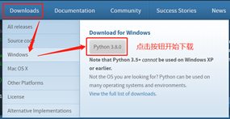

​	2.安装Python解释器。下载完毕后，找到安装文件，直接双击开始运行。安装选项一路默认下一步即可，直至自动开始执行安装程序。安装完毕后，退出，具体如图所示：

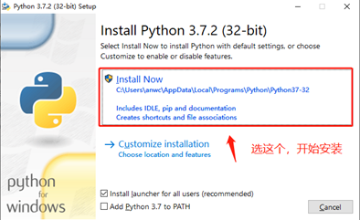

​	3.配置环境变量。桌面图标找到“我的电脑”（WIN10已更改为计算机），右键，属性，弹出界面如图所示：

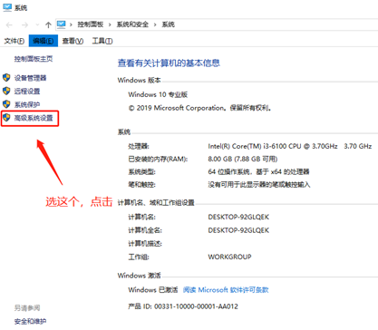

​	选择高级系统设置，进入，如下图：

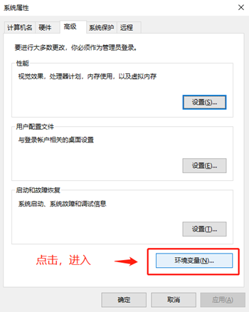

​	看到系统变量，找到path，双击：

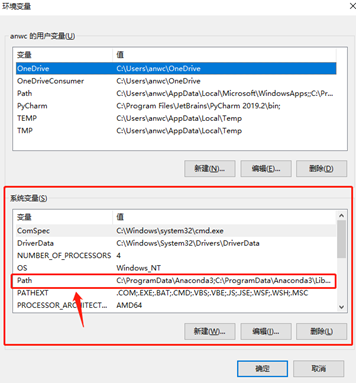

​	选择新建：

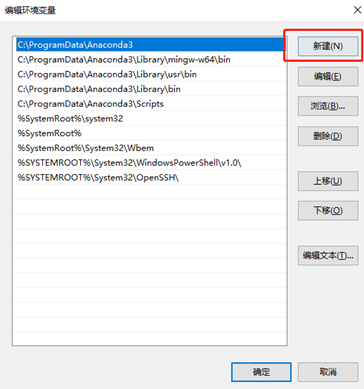

​	在输入区域中输入python.exe的绝对路径：

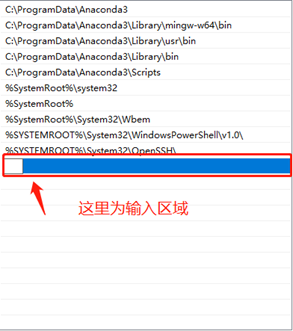

​	绝对路径如何查找：进入安装盘（C or D or其他盘符，具体视安装时路径选择而定，如果是一路默认下一步，则安装在C盘），搜索：python.exe,搜索到该文件后，右键，选择“打开文件位置”，鼠标点击地址栏，即可显示其绝对路径，复制粘贴到此即可。地址栏位置如图所示：

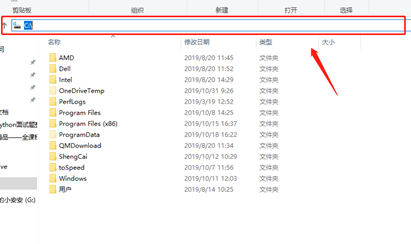

​	本机因已安装好环境，故不展示具体安装过程。

## 使用Anaconda3配置Python环境

​	1．下载Anaconda3 Windows专版安装包。下载路径同上文Linux专版下载路径，只不过选择：Anaconda3-5.3.1-Windows-x86_64.exe即可。
​	2.安装Anaconda3。双击下载的安装包，一路下一步即可，注意，此步骤需勾选该选项：

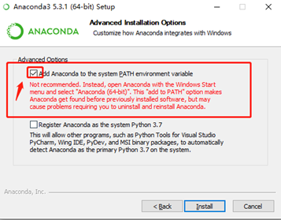

# IDE(集成开发环境)介绍

## Sublime Text 3

​	现如今宇宙最强地位岌岌可危的一款IDE，堪称经典。它是一种情怀，一种信仰。曾经你用的不是sublime你会被笑话不专业，曾经你不用sublime其他程序员小伙伴都不愿跟你玩……是的，确实是IDE中的传奇。Sublime其最强大的地方在于其多到爆炸强到可怕的扩展插件，这些插件活生生将一个神似editplus的文本编辑器变为一个超强的IDE。Sublime里安装上java的插件他就是java的IDE咯，安装上Python的插件他就是Python的IDE咯，安装上C++的插件他就是C++的编辑器咯……它还能安装各种编程语言的扩展插件。比如你羡慕pycharm的代码提示是吗？没关系sublime安装个代码提示扩展插件，你也有这功能了。
​	下载地址：http://www.sublimetext.com/

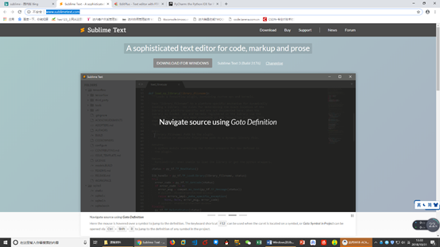

## Visual Studio Code

​	当今的最强IDE，一路干掉pycharm，sublime的佼佼者，来自微软旗下的开源免费IDE，支持一切自定义及扩展，更可怕的是其拥有自主扩展库！对，所有扩展全部来自官方！无需到第三方搜索！其实，虽说windows长期以来并不开源，且售价昂贵，国人只能用着非法激活的官方Windows，但这并不能阻止人们公认为Windows是最好的操作系统。所以可能vscode也是因为出自微软名门才名气够大吧。
​	下载地址：https://code.visualstudio.com/

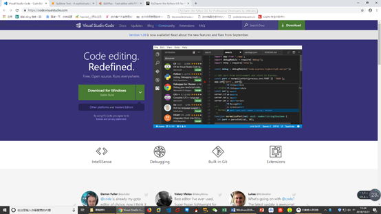

## Pycharm

​	Pycharm号称宇宙最强IDE一点都不过分，当然了这是我没有接触某软的IDE之前的感受。Pycharm集成的功能非常多，他甚至能够直接在IDE内运行你的Python代码。作为Jetbrains名下的明星产品，Pycharm还兼容了其他编程语言的支持，比如WEB前端三大技术HTML,CSS,JavaScript，比如PHP，比如…..可以说，Pycharm只有一条缺点，这也是他唯一的缺点，也是他致命的缺点，那就是……收费！
​	不过，版权这个问题貌似在中国人面前从来不值得一提。微软跟中国程序员干了十几年，也没阻止中国人使用非法激活的正版Windows……so，屈屈一个IDE能奈我何？
​	下载地址：https://www.jetbrains.com/pycharm/ 
​	Pycharm目前官方存在两个版本，一个叫社区版，一个叫专业版。这是官方的称呼。在我们程序员的眼中，无非只是个免费阉割版和收费加强版的区别了。所以，你可以选择使用社区版，毕竟免费的无需激活，安装直接用，但是阉割掉的功能，尤其对于强迫症患者来说，总觉得哪里不爽。我不一定用得到被阉割的功能啊？可是我可以不用，但他不能没有啊！


# Pycharm的安装及配置

## 下载

​	官网地址：https://www.jetbrains.com/pycharm/download/

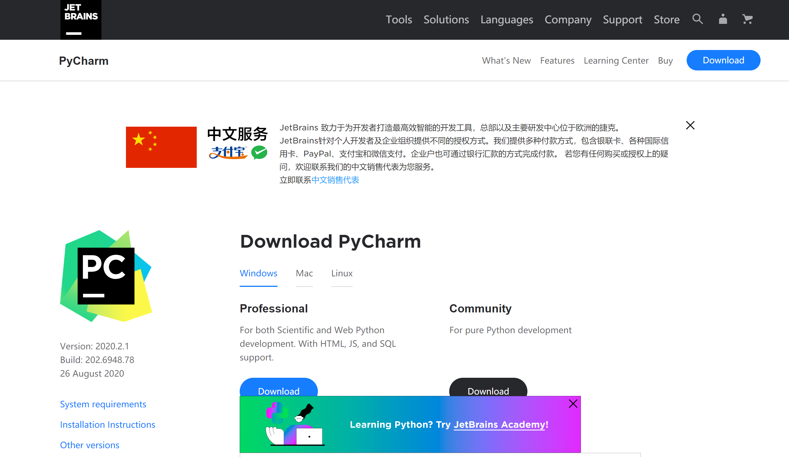

## 安装

​	一路傻瓜式下一步安装即可。

## 破解

​	1.下载激活插件

> 链接: https://pan.baidu.com/s/1EaoFACbgkW7OiHCZyuyvJA 提取码: vwat

​	2.首次打开pycharm选择30天免费试用

​	3.进入pycham界面后，将插件解压后得到的jar包直接拖进窗口区域内，一路确定，等待重启软件即可。

## Pycharm常用快捷键

​	移动到本行开头：home键
​	移动到本行末尾：end键盘
​	注释代码：ctrl + /
​	复制行：ctrl +d
​	选择列：鼠标左键 + alt
​	移动行：shift + alt + 上下箭头
​	智能提示：Ctrl + Space

# Pycharm代码调试

## Python代码调试方法

​	Python代码调试分为两种情况：
​		1.断言调试
​		2.断点调试
​	1.断言调试：即在Python代码内部添加相关断言调试语句，通过预测程序执行到此处相对应的变量可能的值进行测试，如果断言预测正确返回True，否则返回False
​	断言调试语法：
​		assert 真值表达式
​	2.断点调试：借助IDE工具实现。

## Pycharm断点调试工具：debug

​	Pycharm debug界面如下图所示：

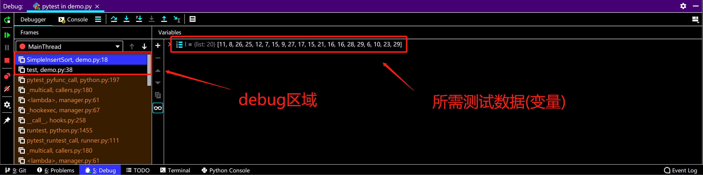

​	debug使用思路：
​	通过在需要测试的某一段代码的起始位置和结束位置打断点进行测试：

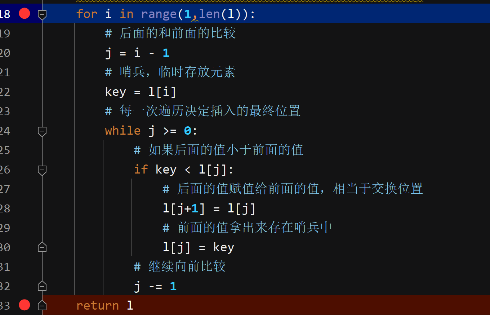

​	然后通过右键选择debug或点击右上角类似小虫子的图标开启debug测试：

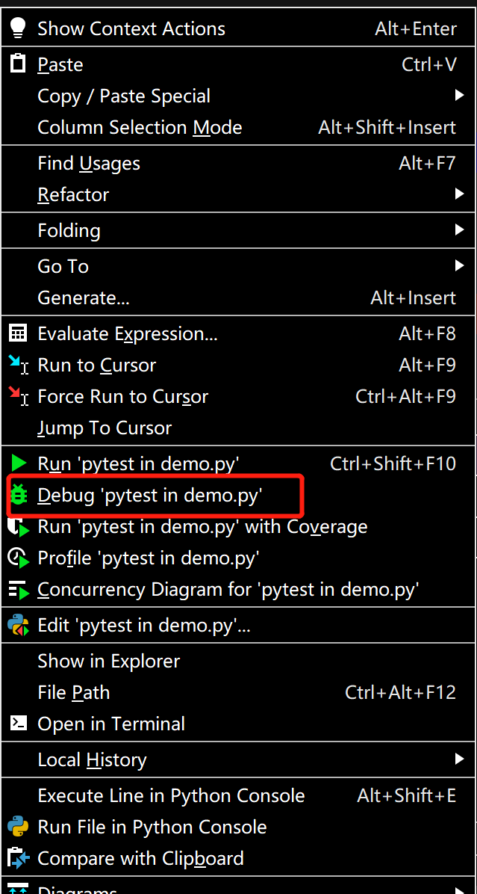


​	在需要测试的代码起始位置及结束位置的行标处通过鼠标左键点击打下断点，debug就会已此处断点为起始和终止位置，在这段区域内进行debug，开发者通过查看程序逐行运行时相对应的参数，变量或数据的值得变化判断程序具体出错在第几行以及具体什么错误。
debug调试时为单步调试模式，但其划分为不同情况下的单步调试：

​	step into(快捷键：F7)：单步执行，遇到子函数就进入并且继续单步执行（简而言之，进入子函数）；
​	step over(快捷键：F8)：在单步执行时，在函数内遇到子函数时不会进入子函数内单步执行，而是将子函数整个执行完再停止，也就是把子函数整个作为一步。有一点,经过我们简单的调试,在不存在子函数的情况下是和step into效果一样的（简而言之，越过子函数，但子函数会执行）。
​	step out(快捷键：shift+F8)：当单步执行到子函数内时，用step out就可以执行完子函数余下部分，并返回到上一层函数。


