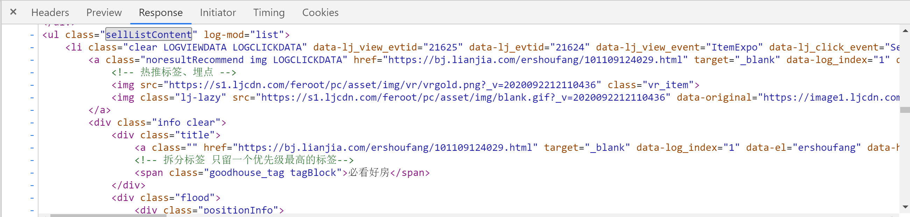

# <font face="楷体"  color='blue'> Python爬虫案例5：链家二手房房源信息抓取案例</font>

<p><font face="楷体" color='blue'>作者：Barranzi_</font></p>
<p><font face="楷体" color='blue'>个人github主页：[github](https://github.com/La0bALanG)</font></p>
<p><font face="楷体" color='blue'>个人邮箱：awc19930818@outlook.com</font></p>
<p><font face="楷体" color='blue'>新时代的铁饭碗：一辈子不管走到哪里都有饭吃(还能吃上热乎的)。——佚名</font></p>
<p><font face="楷体" color='red'> 免责声明：</font></p>
<p><font face='楷体' color='red'>		本系列笔记撰写初衷就是为了分享个人知识以及个人学习历程中的感悟及思考，所涉及到的内容`仅供学习与交流`，请勿用作`非法或商业用途`！由此引发的任何法律纠纷`后果自负`，与作者本人无关！</font></p>
<p><font face="楷体"  color='red'>版权声明：</font></p>
<p><font face='楷体' color='red'>		未经作者本人授权，禁止转载！请尊重原创！</font></p>


<p><font face="楷体" color='blue'>注：本文所有代码、案例测试环境：1.Linux -- 系统版本：Ubuntu20.04 LTS   2.windows -- 系统版本：WIN10 64位家庭版</font></p>
----------------------------------------------------------------------------

# 请求URL及页面数据分析

- 目标URL

  以北京的二手房房源信息为例：https://bj.lianjia.com/ershoufang

- 目标数据

  - F12控制台 -- 查看页面的response -- 确定静态页面
  - 抓取每一条房源信息的名称、户型、面积、方位、精装、楼层、区域、总价、单价信息。

- URL分析

  随意查看几页，观察其URL，确定其URL基本格式：

  ```python
  self.__url = 'https://bj.lianjia.com/ershoufang/pg{}/'#pg后跟页数编号
  ```

- 页面及所需数据分析

  响应内容格式化结果如下：

  

  确定xpath表达式。

  - 基准xpath表达式：匹配每个房源信息节点列表

    此处滚动鼠标滑轮时,li节点的class属性值会发生变化,通过查看网页源码确定xpath表达式：

    ```python
    //ul[@class="sellListContent"]/li[@class="clear LOGVIEWDATA LOGCLICKDATA"]
    ```

  - 依次遍历后每个房源信息的xpath表达式：

    ```python
    名称: './/a[@data-el="region"]/text()'
        
    户型+面积+方位+是否精装
    info_list = './/div[@class="houseInfo"]/text()'[0].strip().split('|')
    
    户型: info_list[1]
    面积: info_list[2]
    方位: info_list[3]
    精装: info_list[4]
        
    楼层: './/div[@class="positionInfo"]/text()'
        
    区域: './/div[@class="positionInfo"]/a/text()'
        
    总价: './/div[@class="totalPrice"]/span/text()'
        
    单价: './/div[@class="unitPrice"]/span/text()'
    ```

# 编码实现

```python
# -*- coding:utf-8 _*-
"""
@version:
author:安伟超
@time: 2020/09/09
@file: demo06_LianjiaHouseSpider_OOP.py.py
@environment:virtualenv
@email:awc19930818@outlook.com
@github:https://github.com/La0bALanG
@requirement:
"""

import threading
import requests
from lxml import etree
from fake_useragent import UserAgent

"""

实现步骤及思路：
1.确定是否为静态页面
打开二手房页面 -> 查看网页源码 -> 搜索关键字

2.确定xpath表达式

    1、基准xpath表达式(匹配每个房源信息节点列表)
       此处滚动鼠标滑轮时,li节点的class属性值会发生变化,通过查看网页源码确定xpath表达式
      //ul[@class="sellListContent"]/li[@class="clear LOGVIEWDATA LOGCLICKDATA"]
    
    2、依次遍历后每个房源信息xpath表达式
       * 名称: './/a[@data-el="region"]/text()'
       
       # 户型+面积+方位+是否精装
       info_list = './/div[@class="houseInfo"]/text()'  [0].strip().split('|')
       * 户型: info_list[1]
       * 面积: info_list[2]
       * 方位: info_list[3]
       * 精装: info_list[4]
       
    
       * 楼层: './/div[@class="positionInfo"]/text()'
       * 区域: './/div[@class="positionInfo"]/a/text()'
       * 总价: './/div[@class="totalPrice"]/span/text()'
       * 单价: './/div[@class="unitPrice"]/span/text()'

"""

class LianjiaHouseSpider(object):
    '''

    面向对象思路：
    1.拆分功能细节。整体程序可拆分为:
        1.发请求获得页面
        2.解析页面
        3.持久化存储(写入文件保存)
    2.结合开闭原则，封装功能方法为私有方法，对外提供统一公共接口
    3.采用单例模式：假设本爬虫程序在多个时间、不同情况下多次使用，单例模式实现只创建一个对象，提升性能避免内存占用过高。

    '''

    _instance_lock = threading.Lock()

    # 单例模式实现：__new__方法
    def __new__(cls, *args, **kwargs):
        if not hasattr(LianjiaHouseSpider, '_instance'):
            with LianjiaHouseSpider._instance_lock:
                if not hasattr(LianjiaHouseSpider, '_instance'):
                    LianjiaHouseSpider._instance = object.__new__(cls)
        return LianjiaHouseSpider

    def __init__(self):
        self.__url = 'https://bj.lianjia.com/ershoufang/pg{}/'
        self.__headers = {
            'User-Agent':UserAgent().random
        }

    #设置只读属性
    @property
    def url(self):
        return self.__url

    @property
    def headers(self):
        return self.__headers

    def __get_html(self,url):
        for i in range(3):
            try:
                return requests.get(url=url, headers=self.__headers,timeout=3).text
            except Exception as e:
                print('Retry')

    def __parse_html(self,html):
        dict = {}
        dom = etree.HTML(html)
        li_list = dom.xpath('//ul[@class="sellListContent"]/li[@class="clear LOGVIEWDATA LOGCLICKDATA"]')
        for item in li_list:

            #解析名称+位置
            name_list = item.xpath('.//div[@class="positionInfo"]/a[1]/text()')
            dict['name'] = name_list[0].strip() if name_list else None
            address_list = item.xpath('.//div[@class="positionInfo"]/a[2]/text()')
            item['address'] = address_list[0] if address_list else None

            #解析：户型+面积+方位+精装+楼层+年代+类型
            hlist = item.xpath('.//div[@class="houseInfo"]/text()')
            if hlist:
                # hlist: ['三室两厅','100平米','南北',...]
                hlist = hlist[0].split('|')
                dict['model'] = hlist[0].strip()
                dict['area'] = hlist[1].strip()
                dict['direct'] = hlist[2].strdict
                dict['perfect'] = hlist[3].strip()
                dict['floor'] = hlist[4].strip()
                dict['year'] = hlist[5].strip()
                dict['type'] = hlist[6].strip()
            else:
                dict['model'] = dict['area'] = dict['direct'] = dict['perfect'] = dict['floor'] = dict['year'] = dict[
                    'type'] = None

            #解析单价+总价
            total_list = item.xpath('.//div[@class="totalPrice"]/span/text()')
            dict['total'] = float(total_list[0]) * 10000 if total_list else None
            unit_list = item.xpath('.//div[@class="unitPrice"]/span/text()')
            dict['unit'] = unit_list[0][2:-4] if unit_list else None

            print(dict)

    def display(self):
        for pg in range(1,101):
            url = self.__url.format(pg)
            self.__parse_html(self.__get_html(url))

def test():
    LianjiaHouseSpider().display()

if __name__ == '__main__':
    test()
```

